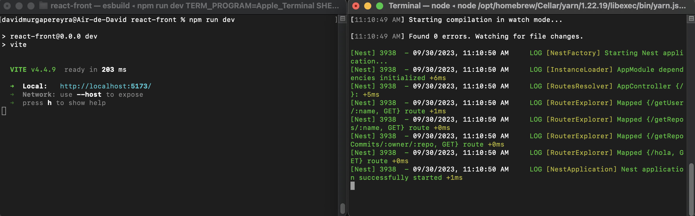

<h1>FTF Challenge</h1>

<strong><h2>Installation</h2></strong>

<span> ● First of all you'll need node and nest installed. You can download node here: https://nodejs.org/es, and install nest from your terminal with this command.</span>

```json
npm i -g @nestjs/cli
```

<span>● Also you'll need yarn to run the backend.</span>

```json
npm install --global yarn
```

<span>● After this installed, clone this repository and open a terminal right into the /nest-api folder and run this commands.</span>

```json
yarn install
```

<span>● After this, you can run the server with this command.</span>

```json
yarn start:dev
```

<span>● Then open a new terminal in the /react-front folder and run this command.</span>

```json
npm install
```

<span>● After this, you can run the app with this command.</span>

```json
npm run dev
```

<span>● It should look something like this:</span>



<span>● Finally, go to your browser at: http://localhost:5173</span>

<strong><h1>WARNINGS</h1></strong>

<span>● In any case you have problems running whether the backend or the frontend, delete the folder node_modules. After deleted the folder install nvm with this command.</span>

```json
npm install nvm
```

<span>● Then install node 19.4.0</span>

```json
nvm install 19.4.0
```

<span>Use the installed version.</span>

```json
nvm use 19.4.0
```

<span>● And repeat the process from above.</span>